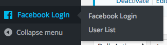
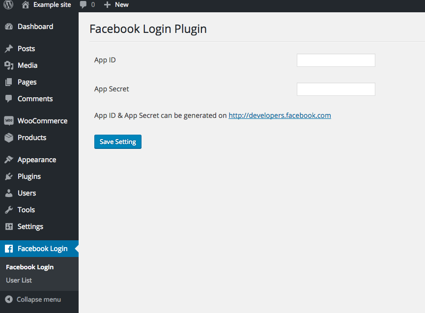
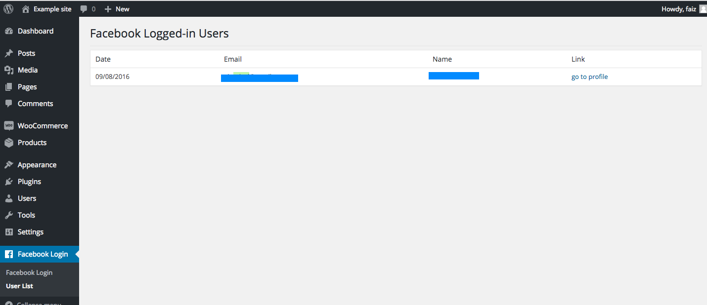
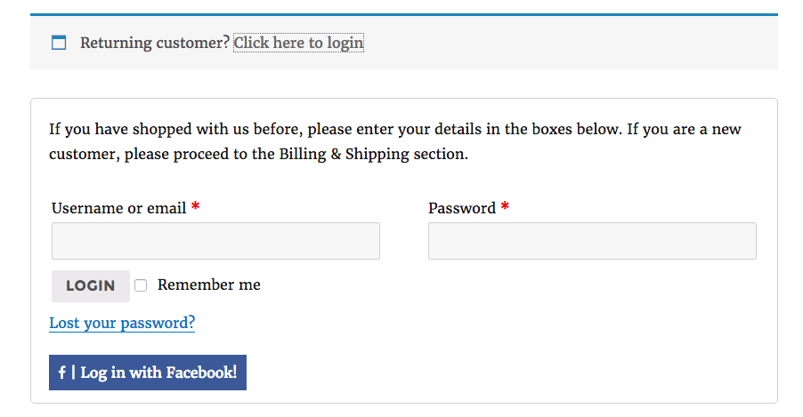
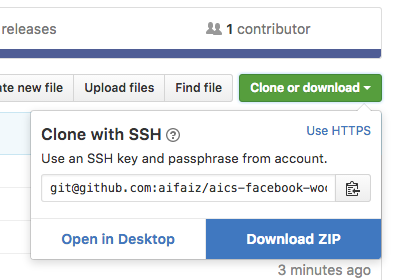
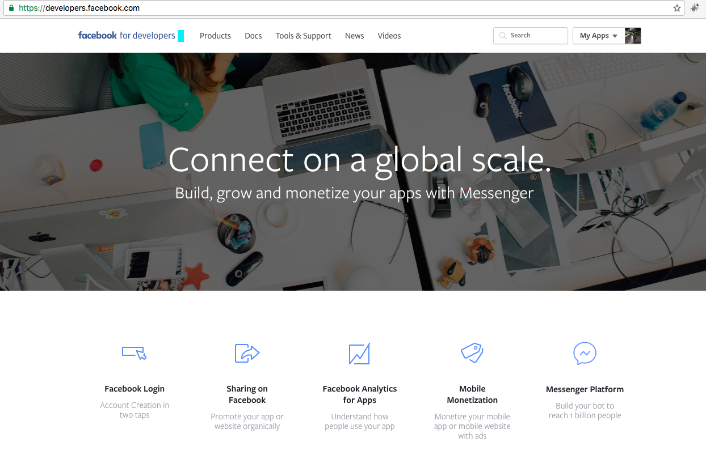
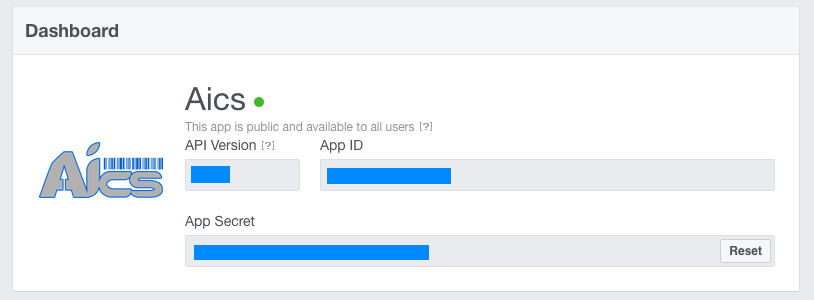

# Woocommerce Facebook Login

Woocommerce plugin for facebook login

```

plugin developed by the request from Like Method Members

```
[what is like method?](https://goo.gl/VmTwIM)

---

### Admin menu


### Facebook API Setting


### Connected User List


### Checkout Login Button


---

## How to install this plugin

1. download this repo as zip file
2. go to your admin page for managing plugin `yourdomain.com/wp-admin/plugin-install.php?tab=upload`
3. upload the zip file you had just downloaded.
4. done. you can now begin setting up the plugin api and start getting user to login using facebook.

### Download as zip is on top right corner of this page


## How to get the APP ID & APP Secret ?

in order for this plugin to work, it will require you to generate your own facebook APP in the developers.facebook.com section

you can go to `http://developers.facebook.com` and create your app. they will generate your app ID and app Secret

### How facebook developer look like ` as in August 2016 `


### Example facebook app


---
## Extra! video guide.
[](https://www.youtube.com/watch?v=tykYT85Hob0)

---
developer: [AiCS Businesses](http://aics.my)


AiCS Businesses is a Malaysian based web developer resides in Kuala Lumpur